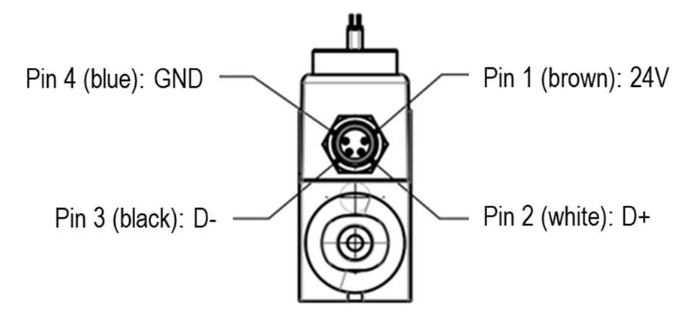
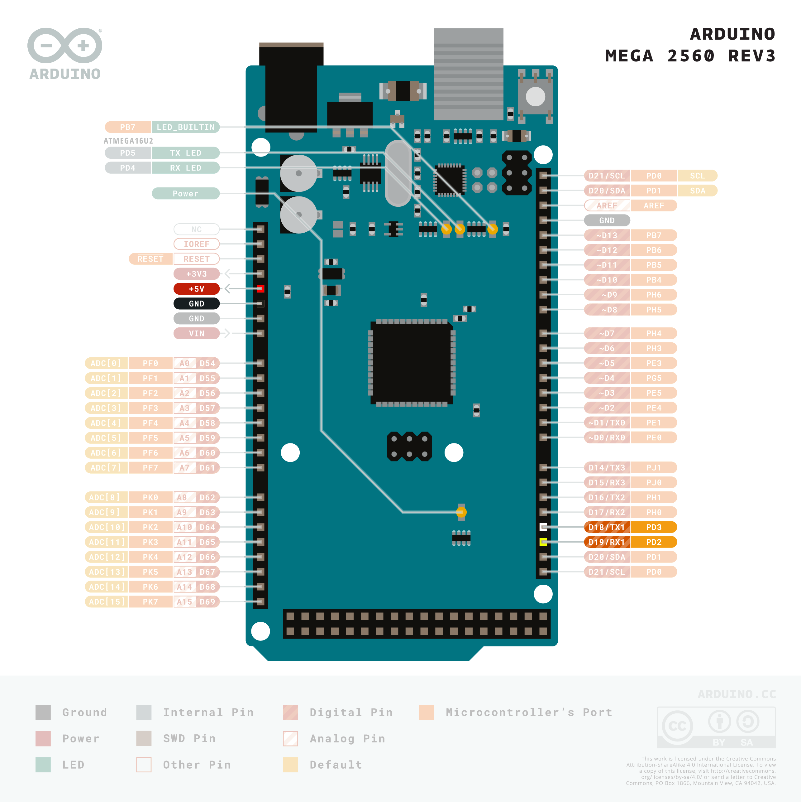
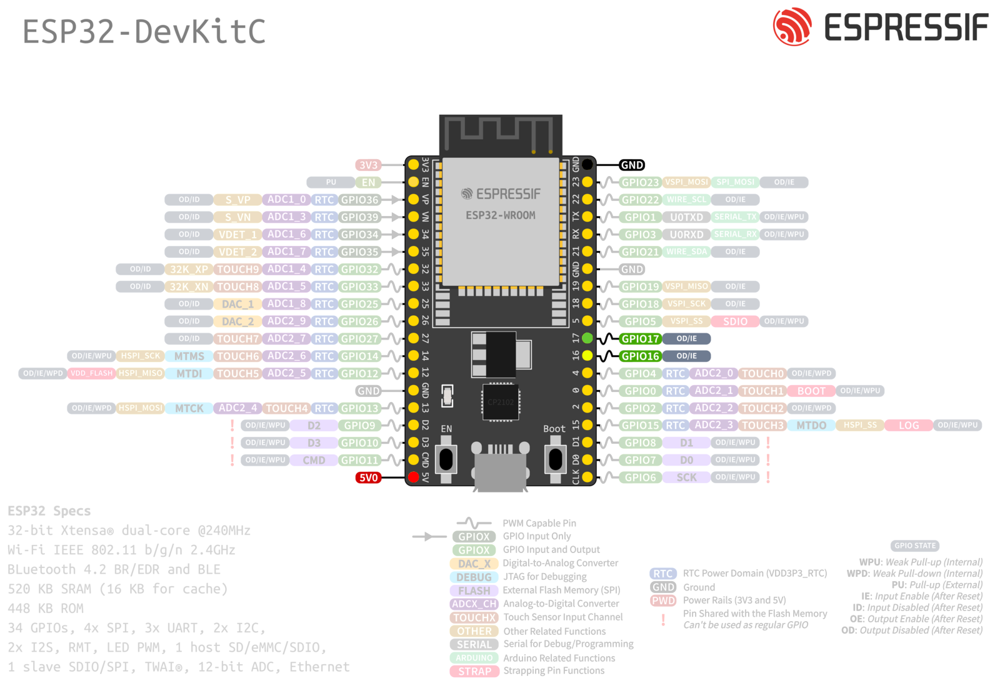

# Sensirion UART SFC6XXX Arduino Library

This is the Sensirion SFC6XXX library for Arduino allowing you to 
communicate with a sensor of the SFC6XXX family over UART using the SHDLC protocol.

<center></center>

Click [here](https://sensirion.com/sfc6000) to learn more about the Sensirion SFC6XXX sensor family.


## Supported sensor types

- [SFC6000](https://sensirion.com/products/catalog/SFC6000/)
- [SFC6000D-5SLM](https://sensirion.com/products/catalog/SFC6000D-5slm/)
- [SFC6000D-50SLM](https://sensirion.com/products/catalog/SFC6000D-50slm/)
- [SFC6000D-20SLM](https://sensirion.com/products/catalog/SFC6000D-20slm/)

The following instructions and examples use a *SFC6000*.


## Installation of the library

This library can be installed using the Arduino Library manager:
Start the [Arduino IDE](http://www.arduino.cc/en/main/software) and open
the Library Manager via

`Sketch` ➔ `Include Library` ➔ `Manage Libraries...`

Search for the `Sensririon UART SFC6XXX` library in the `Filter your search...` 
field and install it by clicking the `install` button.

If you cannot find it in the library manager, download the latest release as .zip file 
and add it to your [Arduino IDE](http://www.arduino.cc/en/main/software) via

`Sketch` ➔ `Include Library` ➔ `Add .ZIP Library...`

Don't forget to **install the dependencies** listed below the same way via library 
manager or `Add .ZIP Library`


## Dependencies
* [Sensirion Core](https://github.com/Sensirion/arduino-core)


## Sensor wiring

### Connecting the Sensor

Use the following pin description to connect your SFC6XXX to your Arduino board:



| *Pin* | *Cable Color* | *Name* | *Description*  | *Comments* |
|-------|---------------|:------:|----------------|------------|
| 1 | brown | VDD | Supply Voltage | +24V
| 2 | white | D+ |  | 
| 3 | black | D- |  | 
| 4 | blue | GND | Ground | 


### Board-specific wiring

We recommend using Arduino Boards or an ESP supporting **two or more hardware serial connections** 
to run the example code. One serial port is needed to connect the SFC6XXX sensor and the other one 
(over USB) for logging to the Serial Monitor of the Arduino IDE.

Arduino Uno, Micro and Nano have only one hardware serial connection and are therefore not recommended to use. 
There is the option to use the SoftwareSerial library to emulate a serial connection, but it does not work 
reliably to communicate with the sensor at the required baudrate of 115200 baud. However, you can connect your sensor 
over the hardware serial connection and use the SoftwareSerial library to set up a connection for logging to the host.

You will find pinout schematics for recommended board models below:

<details><summary>Arduino Mega 2560 Rev3 Pinout</summary>
<p>

| *SFC6XXX* | *SFC6XXX Pin* | *Cable Color* | *Board Pin* |
| :---: | --- | --- | --- |
| VDD | 1 | brown | 5V |
| D+ | 2 | white |  |
| D- | 3 | black |  |
| GND | 4 | blue | GND |


> **Note:** Make sure to connect serial pins as cross-over (RX pin of sensor -> TX pin on Arduino; TX pin of sensor -> RX pin on Ardunio)


</p>
</details>

<details><summary>Espressif ESP32-DevKitC Pinout</summary>
<p>

| *SFC6XXX* | *SFC6XXX Pin* | *Cable Color* | *Board Pin* |
| :---: | --- | --- | --- |
| VDD | 1 | brown | 5V |
| D+ | 2 | white |  |
| D- | 3 | black |  |
| GND | 4 | blue | GND |


> **Note:** Make sure to connect serial pins as cross-over (RX pin of sensor -> TX pin on ESP; TX pin of sensor -> RX pin on ESP)


</p>
</details>

## Quick start example

1. Install the libraries and dependencies according to [Installation of the library](#installation-of-the-library)

2. Connect the SFC6XXX sensor as explained in [Sensor wiring](#sensor-wiring)

3. Load the `exampleUsage` sample project within the Arduino IDE:

   `File` ➔ `Examples` ➔ `Sensirion UART SFC6XXX` ➔ `exampleUsage`

4. Depending on your Arduino board you may need to adapt the code sample. 
See the [board specific instruction](#board-specific-instructions) section for more information. 

5. Make sure to select the correct board model under `Tools` ➔ `Boards` and the 
   connected USB port under `Tools` ➔ `Port`.

6. Click the `Upload` button in the Arduino IDE or `Sketch` ➔ `Upload`

7. When the upload process has finished, open the `Serial Monitor` or `Serial
   Plotter` via the `Tools` menu to observe the measurement values. Note that
   the `Baud Rate` in the used tool has to be set to `115200 baud`.

### Board-specific instructions
<details><summary>Arduino Mega 2560</summary>
<p>

#### Serial Interface
The provided wiring instructed you to connect the SFC6XXX to **Serial Port 1**. 
Therefore, the following line needs to be used in the usage example code:

`#define SENSOR_SERIAL_INTERFACE Serial1`
</p>
</details>


<details><summary>Espressif ESP32-DevKitC</summary>
<p>

#### ESP32 Library
The ESP32 board is not supported by default with Arduino IDE. If it is your first time using an ESP32 board, 
you should follow this [guide](https://docs.espressif.com/projects/arduino-esp32/en/latest/installing.html) from 
Esspressif itself.

#### Serial Interface
The provided wiring instructed you to connect the sensor to **Serial Port 2**.

Since ESP boards require `HardwareSerial` implementation, you need to include the following lines in the usage example code:

```
#include <HardwareSerial.h>
HardwareSerial HwSerial(2);
#define SENSOR_SERIAL_INTERFACE HwSerial
```
</p>
</details>

<details><summary>Emulated serial connection for logging (Arduino Uno, Arduino Nano, Arduino Micro)</summary>
<p>
Use following instructions if your board has only one hardware serial port and you want to emulated a serial 
connection for logging to the host using the SoftwareSerial library.

* To connect your Arduino to your host for the logging connection, you can for example use the [USB to TTL Serial Cable from Adafruit](http://adafru.it/954).

  In the example we use Pin 8 and 9 on the Arduino Board for RX/TX.

    | Cable wire         | Wire color | Arduino Pin     |
    | -------------------|------------|-----------------|
    | TX line out of USB | green      | Pin8            |
    | RX line into USB   | white      | Pin9            |
    | ground             | black      | do not connect  |
    | RX line into USB   | red        | do not connect  |
  


    > Note: depending on your Arduino Board not all Pins can be used for RX, see [SoftwareSerial documentation](https://docs.arduino.cc/learn/built-in-libraries/software-serial#limitations-of-this-library) for more details.

* Adapt example usage code:

   * Add following header lines and set rxPin and txPin numbers to the pin numbers you connected your serial cable to.

      ```
      // Software serial setup
      #include <SoftwareSerial.h>
      #define rxPin 8
      #define txPin 9
      SoftwareSerial sw_serial =  SoftwareSerial(rxPin, txPin);
      ```
   * Set the define for the serial connection to use to communicate with the sensor to
  
     For Arduino Uno and Nano:

     `#define SENSOR_SERIAL_INTERFACE Serial`

     For Arduino Micro:

     `#define SENSOR_SERIAL_INTERFACE Serial1`

   * In the setup() add following lines of code:
      ```
      // Define pin modes for TX and RX
      pinMode(rxPin, INPUT);
      pinMode(txPin, OUTPUT);
      sw_serial.begin(9600);
      ```

      Remove the initialization lines for `Serial` used by default for logging.


   * Replace all occurences of `Serial.print` with `sw_serial.print`


* Load the example to your Arduino. Make sure to unplug supply voltage (5V pin) of the sensor while doing so, otherwise the Arduino IDE cannot communicate over the serial interface (as the USB Port and the TX/RX Pin use the same HW Serial interface).

* Instead of using the `Serial Monitor` or `Serial Plotter` of the Arduino IDE, open a serial monitor on your host system and set the `Baudrate` to `9600 baud`. On Linux you can for example use the `grabserial` tool:

   `grabserial -d /dev/ttyUSB0 -b 9600 --crtonewline`

* Press the Reset Button on your Arduino to restart the example execution once you have the sensor supply voltage plugged back in.

</p>
</details>


## Contributing

**Contributions are welcome!**

We develop and test this driver using our company internal tools (version
control, continuous integration, code review etc.) and automatically
synchronize the master branch with GitHub. But this doesn't mean that we don't
respond to issues or don't accept pull requests on GitHub. In fact, you're very
welcome to open issues or create pull requests :)

This Sensirion library uses
[`clang-format`](https://releases.llvm.org/download.html) to standardize the
formatting of all our `.cpp` and `.h` files. Make sure your contributions are
formatted accordingly:

The `-i` flag will apply the format changes to the files listed.

```bash
clang-format -i src/*.cpp src/*.h
```

Note that differences from this formatting will result in a failed build until
they are fixed.


## License

See [LICENSE](LICENSE).
